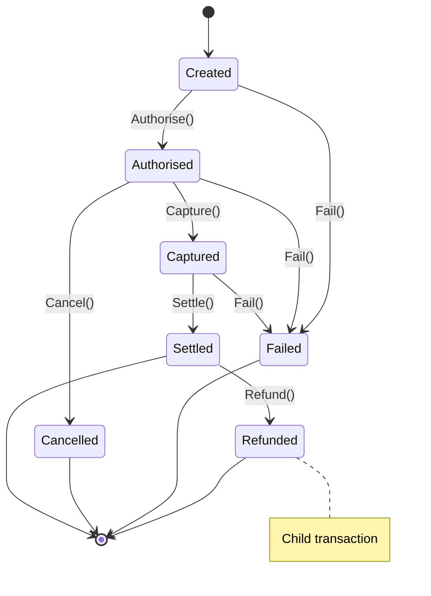

<div align="center">

# PayFlow - Multi-Tenant Payment Processing Platform


A production-ready payment processing platform built with **.NET 9**, featuring strict state machines, multi-tenancy isolation, and event-driven architecture.

</div>

## 🏗️ Architecture Overview

```mermaid
flowchart TB
    subgraph API_Layer ["API Layer (Minimal APIs)"]
        Auth_Middleware["`Auth Middleware`"]
        Error_Handler["`Error Handler` (RFC 9457)"]
        Endpoints["`Endpoints`<br/>POST /v1/payments<br/>GET /v1/payments/{id}"]
    end

    subgraph App_Layer ["Application Layer (MediatR)"]
        CreatePaymentCommand["`CreatePaymentCommand`"]
        ValidationBehavior["`ValidationBehavior`"]
        FluentValidation["`FluentValidation`"]
    end

    subgraph Infra_Layer ["Infrastructure Layer"]
        Redis["`Redis`<br/>Idempotency<br/>Distributed Locks`"]
        Gateway["`Payment Gateway`<br/>Polly Resilience<br/>3 Retries / Circuit Breaker`"]
        ServiceBus["`Service Bus`<br/>Domain Events<br/>Webhooks / SettlementBatch`"]
    end

    subgraph Domain_Layer ["Domain Layer (Clean Architecture)"]
        PaymentAggregate["`Payment Aggregate`<br/>State Machine<br/>Domain Events`"]
    end

    subgraph Persistence ["Persistence (EF Core + SQL)"]
        SQL_Server["`SQL Server 2022`<br/>Multi-tenant<br/>Row-version Concurrency`"]
    end

    API_Layer --> App_Layer
    App_Layer --> Infra_Layer
    App_Layer --> Domain_Layer
    Infra_Layer --> Persistence
    Domain_Layer --> Persistence
```

## 🔄 Payment State Machine



## ✨ Key Features

### 🏢 Multi-Tenancy
- **Shared Database/Schema** approach with EF Core global query filters
- Tenant isolation enforced at database level via `TenantId`
- API key authentication with bcrypt-secured secrets
- Tenant status handling (Active/Suspended/Closed)

### 🔁 Idempotency
- Redis-based with 24-hour TTL
- `SET NX` pattern with processing sentinel
- Detects in-flight and duplicate requests
- Graceful fallback if Redis unavailable

### 🛡️ Resilience
- **Gateway Adapter**: Polly resilience pipeline
  - 3 retries with jittered exponential backoff
  - Circuit breaker (opens after 50% failure rate)
  - 10-second timeout per attempt

### ⚙️ Background Jobs (Hangfire)
- **Webhook Delivery**: Exponential backoff (30s → 5m → 30m → 2h → 5h → 24h)
- **Settlement Batch**: Nightly at 00:30 UTC with Redis distributed locking

### 🔒 Security
- HMAC-SHA256 webhook signatures with timestamp validation (300s tolerance)
- HTTPS enforcement for webhook endpoints
- No sensitive data (PAN/CVV) in payloads

## 🛠️ Technology Stack

| Layer | Technology | Logo |
|-------|------------|------|
| Runtime | .NET 9.0 | `󰅲` |
| API | ASP.NET Core Minimal APIs | `󰅲` |
| ORM | Entity Framework Core 9.0 (SQL Server) | `󰆼` |
| Cache | StackExchange.Redis | `󰔟` |
| Messaging | Azure Service Bus | `󰔟` |
| Background Jobs | Hangfire | `󰏆` |
| Resilience | Polly | `󰏆` |
| Validation | FluentValidation | `󰏆` |
| Frontend | React 19 + TypeScript + Tailwind | `󰅲` |

## 📁 Project Structure

```
payflow/
├── src/
│   ├── PayFlow.Domain/           # Core domain logic
│   │   ├── Entities/             # Payment, Refund, Tenant, ApiKey
│   │   ├── ValueObjects/         # Money, Currency, Ids
│   │   ├── Events/               # Domain events
│   │   ├── Enums/                # PaymentStatus, RefundStatus
│   │   └── Exceptions/           # Domain exceptions
│   │
│   ├── PayFlow.Application/      # Application services
│   │   ├── Commands/             # MediatR commands
│   │   ├── Interfaces/           # Repository abstractions
│   │   ├── DTOs/                 # Response DTOs
│   │   └── Behaviors/            # Pipeline behaviors
│   │
│   ├── PayFlow.Infrastructure/   # External concerns
│   │   ├── Persistence/          # EF Core DbContexts
│   │   ├── Redis/                # Idempotency service
│   │   ├── Gateways/             # Payment gateway adapters
│   │   ├── Jobs/                 # Hangfire jobs
│   │   ├── ServiceBus/           # Event publishing
│   │   └── Signing/              # HMAC webhook signing
│   │
│   └── PayFlow.Api/              # API entry point
│       ├── Middleware/           # Auth, Error handling
│       ├── Endpoints/            # Minimal API routes
│       └── Configuration/        # DI configuration
│
├── frontend/                     # React Frontend
│   ├── src/
│   │   ├── api/                  # API clients
│   │   ├── components/           # Reusable components
│   │   ├── contexts/             # Auth context
│   │   ├── hooks/                # Custom hooks
│   │   ├── pages/                # Page components
│   │   └── types/                # TypeScript types
│   └── ...
│
└── tests/                        # Unit & Integration Tests
    ├── PayFlow.Domain.Tests/
    └── PayFlow.Integration.Tests/
```

## 🚀 Quick Start

```bash
# Restore and build
dotnet build

# Run tests
dotnet test

# Run the API
dotnet run --project src/PayFlow.Api/PayFlow.Api.csproj
```

## 📡 API Endpoints

### Create Payment
```bash
POST /v1/payments
Authorization: Bearer pk_live_xxxxx
Idempotency-Key: unique-key-123

{
  "amount": 10000,
  "currency": "GBP",
  "customerId": "cus_123",
  "paymentMethod": {
    "type": "card",
    "token": "tok_xxx"
  },
  "autoCapture": false
}
```

### Get Payment
```bash
GET /v1/payments/pay_abc123
Authorization: Bearer pk_live_xxxxx
```

## 🔍 Health Checks

- **Ready**: `/health/ready` - Checks database connectivity
- **Live**: `/health/live` - Basic liveness probe

## 📊 Background Jobs Dashboard

- **Hangfire Dashboard**: `/admin/hangfire`

## ✅ Tests

```bash
dotnet test
# Passed!  - Failed: 0, Passed: 45, Skipped: 0
```

### Test Coverage
- **Domain Tests**: Payment state machine, refund logic, events
- **Integration Tests**: Multi-tenancy isolation, Redis idempotency, webhook signing
- **Security Tests**: HMAC verification, HTTPS enforcement, sensitive data scrubbing

## 📄 License

MIT License

## Key Features

### Multi-Tenancy
- **Shared Database/Schema** approach with EF Core global query filters
- Tenant isolation enforced at database level via `TenantId`
- API key authentication with bcrypt-secured secrets
- Tenant status handling (Active/Suspended/Closed)

### Idempotency
- Redis-based with 24-hour TTL
- `SET NX` pattern with processing sentinel
- Detects in-flight and duplicate requests
- Graceful fallback if Redis unavailable

### Resilience
- **Gateway Adapter**: Polly resilience pipeline
  - 3 retries with jittered exponential backoff
  - Circuit breaker (opens after 50% failure rate)
  - 10-second timeout per attempt

### Background Jobs (Hangfire)
- **Webhook Delivery**: Exponential backoff (30s → 5m → 30m → 2h → 5h → 24h)
- **Settlement Batch**: Nightly at 00:30 UTC with Redis distributed locking

### Security
- HMAC-SHA256 webhook signatures with timestamp validation (300s tolerance)
- HTTPS enforcement for webhook endpoints
- No sensitive data (PAN/CVV) in payloads

## Technology Stack

| Layer | Technology |
|-------|------------|
| Runtime | .NET 9.0 |
| API | ASP.NET Core Minimal APIs |
| ORM | Entity Framework Core 9.0 (SQL Server) |
| Cache | StackExchange.Redis |
| Messaging | Azure Service Bus |
| Background Jobs | Hangfire |
| Resilience | Polly |
| Validation | FluentValidation |

## Project Structure

```
src/
├── PayFlow.Domain/           # Core domain logic
│   ├── Entities/            # Payment, Refund, Tenant, ApiKey
│   ├── ValueObjects/        # Money, Currency, Ids
│   ├── Events/              # Domain events
│   ├── Enums/               # PaymentStatus, RefundStatus
│   └── Exceptions/         # Domain exceptions
│
├── PayFlow.Application/     # Application services
│   ├── Commands/            # MediatR commands
│   ├── Interfaces/          # Repository abstractions
│   ├── DTOs/               # Response DTOs
│   └── Behaviors/          # Pipeline behaviors
│
├── PayFlow.Infrastructure/  # External concerns
│   ├── Persistence/        # EF Core DbContexts
│   ├── Redis/              # Idempotency service
│   ├── Gateways/           # Payment gateway adapters
│   ├── Jobs/               # Hangfire jobs
│   ├── ServiceBus/         # Event publishing
│   └── Signing/            # HMAC webhook signing
│
└── PayFlow.Api/            # API entry point
    ├── Middleware/          # Auth, Error handling
    ├── Endpoints/           # Minimal API routes
    └── Configuration/       # DI configuration
```

## Quick Start

```bash
# Restore and build
dotnet build

# Run tests
dotnet test

# Run the API
dotnet run --project src/PayFlow.Api/PayFlow.Api.csproj
```

## API Endpoints

### Create Payment
```bash
POST /v1/payments
Authorization: Bearer pk_live_xxxxx
Idempotency-Key: unique-key-123

{
  "amount": 10000,
  "currency": "GBP",
  "customerId": "cus_123",
  "paymentMethod": {
    "type": "card",
    "token": "tok_xxx"
  },
  "autoCapture": false
}
```

### Get Payment
```bash
GET /v1/payments/pay_abc123
Authorization: Bearer pk_live_xxxxx
```

## Health Checks

- **Ready**: `/health/ready` - Checks database connectivity
- **Live**: `/health/live` - Basic liveness probe

## Background Jobs Dashboard

- **Hangfire Dashboard**: `/admin/hangfire`

## Tests

```
dotnet test

Passed!  - Failed: 0, Passed: 45, Skipped: 0
```

### Test Coverage
- **Domain Tests**: Payment state machine, refund logic, events
- **Integration Tests**: Multi-tenancy isolation, Redis idempotency, webhook signing
- **Security Tests**: HMAC verification, HTTPS enforcement, sensitive data scrubbing

## License

MIT License
